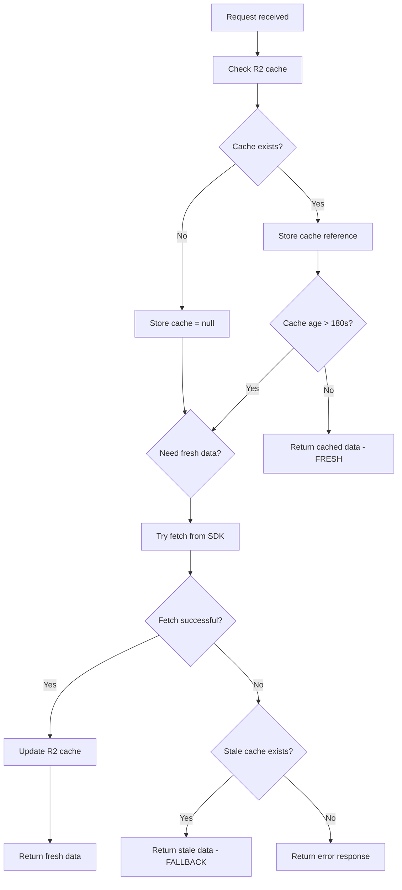

# Stale Cache Fallback Architecture Plan

## Overview
Modify the Cloudflare Worker to return stale cached data when sub-requests to the moonwell-sdk fail, instead of returning an error. This provides better resilience and availability for API consumers.

## Current Behavior
```
1. Check R2 bucket for cached data
2. If cache is missing OR older than 180 seconds → Fetch fresh data from SDK
3. If cache exists and is fresh (< 180s) → Return cached data
4. No error handling for SDK failures
```

## New Behavior
```
1. Check R2 bucket for cached data
2. Store reference to any existing cached data (regardless of age)
3. If cache is missing OR older than 180 seconds:
   a. Try to fetch fresh data from SDK
   b. On success → Cache and return fresh data
   c. On failure:
      - If stale cache exists → Return stale cached data with logging
      - If no cache exists → Return error response
4. If cache exists and is fresh (< 180s) → Return cached data
```

## Implementation Strategy

### Flow Diagram


### Code Changes Required

#### 1. Store Cache Reference Early
```typescript
// Before checking cache age, store the object reference
const object = await env.MY_BUCKET.get(uri);
const cacheExists = object !== null;
const cacheIsStale = cacheExists && object.uploaded.getTime() < (Date.now() - 180000);
```

#### 2. Wrap SDK Calls in Try-Catch
```typescript
if (!cacheExists || cacheIsStale) {
  try {
    // Existing fetch logic
    const moonwellClient = createMoonwellClient(...);
    const markets = await moonwellClient.getMarkets(...);
    const vaults = await moonwellClient.getMorphoVaults(...);
    // ... serialize and cache
    return respond(output);
  } catch (error) {
    // Error handling logic here
  }
}
```

#### 3. Fallback to Stale Cache on Error
```typescript
catch (error) {
  console.error('SDK request failed:', error);
  
  if (cacheExists) {
    console.log('Returning stale cached data as fallback');
    const data = await object.json() as { data: Record<string, unknown>, uploaded: string };
    console.log('Stale cache age:', Date.now() - new Date(data.uploaded).getTime(), 'ms');
    return respond(data.data);
  }
  
  console.error('No cached data available for fallback');
  return respond({ error: 'Service temporarily unavailable' }, 503);
}
```

#### 4. Enhanced Logging
Add distinct console.log messages for:
- `'Cache hit - returning fresh cached data'` (within 180s TTL)
- `'Cache miss or stale - fetching fresh data'` (attempting SDK call)
- `'SDK request failed - returning stale cached data as fallback'` (error + stale cache)
- `'SDK request failed - no cached data available'` (error + no cache)

## Benefits

### Improved Availability
- API remains available even when backend SDK requests fail
- Stale data is better than no data for most use cases

### Graceful Degradation
- Normal operation: Fresh data with 180s cache
- Degraded operation: Stale data when upstream fails
- Complete failure: Error only when no cache exists at all

### Transparent Operation
- Enhanced logging makes it clear what data source is being used
- Monitoring can track fallback frequency to detect upstream issues

## Testing Scenarios

1. **Normal operation**: Cache miss → successful fetch → cache and return
2. **Normal operation**: Cache hit (< 180s) → return cached data
3. **Stale cache fallback**: Cache stale + SDK failure → return stale cache
4. **Complete failure**: No cache + SDK failure → return 503 error
5. **Recovery**: Stale cache being used → SDK recovers → fresh data returned

## Rollback Plan

If issues arise, the change is isolated to the [`fetch()`](src/index.ts:36) function. Reverting the try-catch block restores original behavior where errors propagate immediately.

## Considerations

### Cache Timestamp
The cached object includes an `uploaded` timestamp. When returning stale data on error, we should log how old the cache is for monitoring purposes.

### Error Types
Different SDK errors (network timeout, rate limit, invalid response) all trigger the same fallback behavior. This is intentional for simplicity and reliability.

### Maximum Stale Age
Currently no limit on how old the stale cache can be. If desired, could add a maximum stale age (e.g., 1 hour) beyond which we return an error even if cache exists.

## Next Steps

Once this plan is approved, the implementation can proceed in Code mode to:
1. Modify [`src/index.ts`](src/index.ts) with the new error handling logic
2. Test the changes locally with wrangler dev
3. Deploy to Cloudflare Workers
